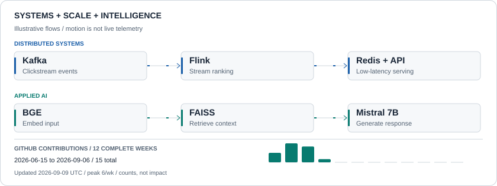

<picture>
  <source media="(max-width: 600px) and (prefers-color-scheme: dark)" srcset="assets/system-flow-mobile-dark.svg">
  <source media="(max-width: 600px)" srcset="assets/system-flow-mobile-light.svg">
  <source media="(prefers-color-scheme: dark)" srcset="assets/system-flow-dark.svg">
  
</picture>

  Building real-time backend systems and intelligent applications. 
  <strong>AI/ML Research · American University</strong>

  <a href="https://www.linkedin.com/in/aruthra-sathish-kumar369/"><strong>LinkedIn</strong></a>
  &nbsp; / &nbsp;
  <a href="mailto:aruthra.sathish@gmail.com"><strong>Email</strong></a>
  &nbsp; / &nbsp;
  <a href="#selected-work"><strong>Selected work</strong></a>
  &nbsp; / &nbsp;
  <a href="#research"><strong>Research</strong></a>

## Selected work

<table>
<tr>
<td>

**01 / INCIDENT RESPONSE**

### [WatchTower](https://github.com/aruthrasathish/Watchtower-MCP-server-for-incident-response)

**From operational evidence to controlled Kubernetes remediation.**

An AI-assisted investigation platform that connects operational data, ranks suspects, and places an **HMAC-SHA256 approval broker** between investigation and remediation.

<table>
<tr>
<th align="left">Investigation interface</th>
<th align="left">Evidence collection</th>
<th align="left">Simulated triage</th>
</tr>
<tr>
<td><strong>12 MCP tools</strong></td>
<td><strong>4 data sources</strong></td>
<td><strong>~83% less time</strong></td>
</tr>
</table>

**Engineering focus**  
Connecting AI-assisted investigation to an explicit approval boundary for Kubernetes operations.

Python · MCP · Kubernetes · PostgreSQL · TimescaleDB · pgvector

[**Inspect the implementation →**](https://github.com/aruthrasathish/Watchtower-MCP-server-for-incident-response)

</td>
</tr>
</table>

<table>
<tr>
<td width="50%" valign="top">

**02 / STREAM PROCESSING**

### [Real-Time Search Ranking](https://github.com/aruthrasathish/Real-time-Search-Ranking-System)

**Continuously updated rankings. Separate request serving.**

Kafka ingests clickstream events. Flink aggregates clicks in **30-second windows**. Redis sorted sets maintain rankings for Node.js APIs.

**Engineering focus**  
Deterministic ranking, asynchronous computation, and tiered caching.

Kafka · Apache Flink · Redis · Node.js

[**Inspect the pipeline →**](https://github.com/aruthrasathish/Real-time-Search-Ranking-System)

</td>
<td width="50%" valign="top">

**03 / RETRIEVAL & INFERENCE**

### [USDA AI Assistant](https://github.com/aruthrasathish/usda-chatbot)

**176 federal programs. One retrieval-augmented discovery system.**

BGE embeddings and FAISS retrieval connect program information to Mistral 7B generation.

**Project measurements**  
Response latency: **~90s → 8s**. Automated **11+ hours of scraping work**.

FastAPI · PostgreSQL · FAISS · LlamaIndex · Mistral 7B

[**Inspect the implementation →**](https://github.com/aruthrasathish/usda-chatbot)

</td>
</tr>
</table>

<strong>More work / real-time communication, authentication, and sequence modeling</strong>

 

| Project | Engineering focus |
| :--- | :--- |
| **[SpeakUp](https://github.com/aruthrasathish/anonymous-voice-QA-platform)** | Kafka-backed voice processing and WebSocket interaction. Designed for 500+ concurrent users per room; the project README reports sub-100ms real-time updates. |
| **[CareerLens](https://github.com/aruthrasathish/job-application-tracker)** | Web application and Chrome extension connected through Google OAuth and cross-origin JWT authentication. 21 REST endpoints for application analytics. |
| **[Academic Performance Intelligence](https://github.com/aruthrasathish/academic-performance-predictor-CNN-GRU)** | PyTorch sequence modeling with MLflow. Reported results: 88.9% classification accuracy for GRU v1; 7.40-point grade-prediction MAE for CNN-GRU v2. |

## Research

<table>
<tr>
<td>

**CAM-SOFT / AMERICAN UNIVERSITY**

### Language understanding beyond literal meaning

**AI/ML Research Intern · 2026–Present**

Investigating soft hate speech whose meaning depends on context and implication. Working with **Llama 3.1 8B, transformer embeddings, LoRA/PEFT, and cross-dataset evaluation**, using PyTorch and Hugging Face.

Ongoing research directions include counterfactual learning and scalable NLP experimentation.

</td>
</tr>
</table>

## Engineering toolkit

| Area | Technologies |
| :--- | :--- |
| **Languages** | Python · Java · TypeScript · JavaScript · SQL · Bash |
| **Backend** | FastAPI · Django · Node.js · REST APIs · WebSockets |
| **Distributed systems & data** | Kafka · Apache Flink · Redis · PostgreSQL |
| **AI / ML** | PyTorch · Transformers · LoRA/PEFT · RAG · FAISS |
| **Infrastructure** | Linux · Docker · Kubernetes · AWS · Terraform · GitHub Actions |

## Background

**George Mason University · M.S. Information Systems · May 2026**  
**Academic Excellence Award · 3.97 / 4.0 GPA**

- **Graduate Teaching Assistant · GMU** — server-side development, REST APIs, and SQL.
- **Software Engineer Intern · Verzeo Edutech** — authentication, API performance, and relational databases.
- **B.Tech Information Technology · Anna University**

---

  <strong>Backend systems · Distributed infrastructure · Applied AI · ML systems</strong> 
  <a href="mailto:aruthra.sathish@gmail.com">Get in touch</a>

