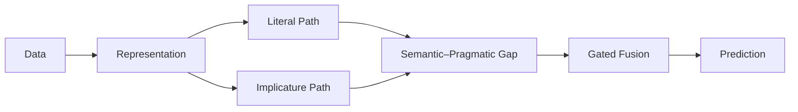

<div align="center">

# Aruthra Sathish Kumar

### Software Engineer · Distributed Systems · Applied AI/ML

<a href="https://git.io/typing-svg">
  
</a>

<br/>

<a href="YOUR_LINKEDIN_URL">
  
</a>
&nbsp;
<a href="YOUR_PORTFOLIO_URL">
  
</a>
&nbsp;
<a href="YOUR_RESUME_URL">
  
</a>
&nbsp;
<a href="mailto:YOUR_EMAIL">
  
</a>

</div>

---

## `> engineering_identity`

> **The systems I find most interesting are the ones where software, scale, and intelligence collide.**

I build software across **backend engineering, distributed systems, cloud infrastructure, and applied AI/ML** — from real-time event-driven applications and production-style APIs to LLM-powered retrieval systems and GPU-based machine learning workflows.

My focus is not just getting software to work, but engineering systems that remain **fast, reliable, scalable, and understandable as complexity grows**.

```text
                    SOFTWARE ENGINEERING
                            │
                 ┌──────────┴──────────┐
                 │                     │
          DISTRIBUTED SYSTEMS       APPLIED AI / ML
                 │                     │
       Kafka · Flink · Redis      LLMs · PyTorch · RAG
       APIs · WebSockets · K8s    LoRA · Embeddings · NLP
                 │                     │
                 └──────────┬──────────┘
                            │
                    INTELLIGENT SYSTEMS
```

---

# Featured Engineering

<table>
<tr>
<td width="50%" valign="top">

## ⚙️ WatchTower

**AI-Assisted Kubernetes Incident Response**

`AI × Infrastructure × Distributed Systems`

A production-style incident-response platform that brings operational signals together, ranks likely suspects, and supports controlled Kubernetes remediation.

```text
Operational Signals
       │
       ▼
  12 MCP Tools
       │
       ▼
 Unified Event Store
       │
       ▼
4-Signal Ranking
       │
       ▼
 AI Investigation
       │
       ▼
Approval-Controlled
K8s Remediation
```

**Engineering highlights**

* Built **12 MCP tools across 4 operational data sources**
* Designed a unified **PostgreSQL + TimescaleDB + pgvector** event store
* Implemented multi-signal suspect ranking for incident investigation
* Added **HMAC-SHA256 approval controls** around Kubernetes remediation
* Reduced project-evaluation triage time by **83%**

**Stack**

`Python` · `MCP` · `Kubernetes` · `PostgreSQL` · `TimescaleDB` · `pgvector`

<br/>

<a href="YOUR_WATCHTOWER_REPOSITORY_URL">
  
</a>

</td>

<td width="50%" valign="top">

## ⚡ SpeakUp

**Real-Time Anonymous Voice Q&A**

`Real-Time Systems × Event-Driven Architecture`

A real-time platform for anonymous voice questions with asynchronous transcription, event-driven processing, and low-latency audience interaction.

```text
Voice Upload
     │
     ▼
202 Accepted
     │
     ▼
    Kafka
     │
     ├────► Whisper
     │
     ▼
 PostgreSQL
     │
     ▼
Redis + WebSockets
     │
     ▼
Live Audience
```

**Engineering highlights**

* Supported **500+ simultaneous WebSocket connections**
* Built an asynchronous Kafka-based voice-processing pipeline
* Integrated speech transcription across **99+ languages**
* Achieved **sub-100ms vote synchronization**
* Enforced vote integrity with PostgreSQL uniqueness constraints
* Added Redis-backed rate limiting

**Stack**

`Next.js` · `Fastify` · `Kafka` · `WebSockets` · `PostgreSQL` · `Redis` · `Whisper`

<br/>

<a href="YOUR_SPEAKUP_REPOSITORY_URL">
  
</a>

</td>
</tr>

<tr>
<td width="50%" valign="top">

## 🧠 USDA AI Assistant

**RAG for Rural Development Programs**

`LLM Engineering × Retrieval Systems`

An AI retrieval system for navigating USDA Rural Development programs using semantic search, vector retrieval, and GPU-backed LLM inference.

```text
User Query
    │
    ▼
BGE Embedding
    │
    ▼
FAISS Retrieval
    │
    ▼
Relevant Context
    │
    ▼
 Mistral 7B
    │
    ▼
Grounded Answer
```

**Engineering highlights**

* Built a knowledge system covering **176 federal programs**
* Automated approximately **11+ hours** of manual data collection
* Implemented BGE embedding + FAISS vector retrieval
* Reduced LLM inference latency from approximately **90s → 8s**
* Integrated GPU-backed Mistral 7B inference

**Stack**

`Python` · `FAISS` · `LlamaIndex` · `PostgreSQL` · `BGE` · `Mistral 7B`

<br/>

<a href="YOUR_USDA_REPOSITORY_URL">
  
</a>

</td>

<td width="50%" valign="top">

## 🚀 CareerLens

**Job Intelligence Platform**

`Backend Systems × Product Engineering`

A full-stack job intelligence platform combining application tracking, authentication, browser-extension workflows, funnel analytics, and behavioral insights.

```text
Chrome Extension
       │
       ▼
 OAuth / JWT
       │
       ▼
 FastAPI
       │
       ├────► Analytics
       │
       ▼
 PostgreSQL
       │
       ▼
React Dashboard
```

**Engineering highlights**

* Designed and implemented **21 REST endpoints**
* Built Google OAuth + JWT authentication flows
* Implemented cross-origin authentication synchronization
* Created source-funnel application analytics
* Built a 7-day rolling behavioral detector that reduced false positives by **30%**

**Stack**

`React` · `Tailwind CSS` · `FastAPI` · `PostgreSQL` · `OAuth` · `JWT` · `Chrome Extension`

<br/>

<a href="YOUR_CAREERLENS_REPOSITORY_URL">
  
</a>

</td>
</tr>
</table>

---

## 🔎 Real-Time Search Ranking System

`Streaming Systems × Ranking × Low-Latency Architecture`

A production-style search-ranking system exploring how streaming signals, low-latency state, and ranking logic can be combined in a distributed architecture.

```text
Events
  │
  ▼
Kafka
  │
  ▼
Flink Processing
  │
  ├──────────────► Feature / Ranking Pipeline
  │
  ▼
Redis State
  │
  ▼
Low-Latency Ranking
```

**Core engineering areas**

`Kafka` · `Flink` · `Redis` · `Streaming` · `Ranking Systems` · `Event-Driven Architecture`

<a href="YOUR_SEARCH_RANKING_REPOSITORY_URL">
  
</a>

---

# 🔬 Active Research

### American University · AI/ML Research

## CAM-Soft

**Scalable Multimodal Fusion for Soft Hate Speech Detection via Camouflaged-Implicature Modeling and Counterfactual Invariance**

I am currently working on research exploring how **literal meaning, implicature, contextual signals, and representation learning** can be combined to better model subtle forms of online hate speech.



### Research engineering

`PyTorch` · `LLMs` · `LoRA` · `Transformer Embeddings` · `Multimodal Learning` · `NLP`

`Cross-Dataset Evaluation` · `Counterfactual Learning` · `Cross-Attention` · `GPU Workflows`

Current work includes:

* Building scalable NLP and dataset-processing pipelines across multiple hate-speech datasets
* Experimenting with **8B-class LLMs**, transformer embeddings, and parameter-efficient adaptation
* Modeling literal and implicature-oriented representations
* Exploring gated cross-attention and semantic-pragmatic fusion
* Designing cross-dataset experiments and counterfactual learning components
* Running ML experimentation across GPU-backed environments

---

# Systems I Build With

### Languages

<p>

</p>

`Python` · `Java` · `TypeScript` · `JavaScript` · `SQL` · `Bash`

### Backend & APIs

<p>

</p>

`FastAPI` · `Django` · `Node.js` · `Fastify` · `REST APIs` · `GraphQL` · `WebSockets` · `Microservices`

### AI / Machine Learning

<p>

</p>

`PyTorch` · `Transformers` · `LLMs` · `LoRA` · `RAG` · `Embeddings` · `NLP` · `Vector Search`

### Distributed Systems & Data

<p>

</p>

`Kafka` · `Flink` · `PostgreSQL` · `MySQL` · `MongoDB` · `Redis` · `pgvector`

### Cloud & Infrastructure

<p>

</p>

`AWS` · `Azure` · `GCP` · `Docker` · `Kubernetes` · `Terraform` · `GitHub Actions` · `Linux`

### Systems

`Distributed Systems` · `Event-Driven Architecture` · `Data Pipelines` · `Concurrency` · `Caching`

`Fault Tolerance` · `Scalability` · `Query Optimization` · `Batch & Stream Processing`

---

# Engineering Experience

<table>
<tr>
<td width="24%" valign="top">

### American University

**2026 — Present**

</td>

<td valign="top">

### AI/ML Research

Research engineering across multimodal ML, LLM experimentation, PyTorch, LoRA, transformer embeddings, NLP pipelines, cross-dataset evaluation, and GPU-backed experimentation.

</td>
</tr>

<tr>
<td width="24%" valign="top">

### George Mason University

**2025 — 2026**

</td>

<td valign="top">

### Graduate Teaching Assistant · Server-Side Development

Supported **100+ students** working with Node.js, Express/Fastify, REST APIs, asynchronous backend workflows, MySQL, schema design, query optimization, and debugging.

</td>
</tr>

<tr>
<td width="24%" valign="top">

### Verzeo

**2022 — 2023**

</td>

<td valign="top">

### Software Engineering Intern

Worked across React, Django, Django REST Framework, authentication, relational data modeling, API data-access optimization, pagination, and database performance.

</td>
</tr>
</table>

---

# Engineering Principles

<table>
<tr>
<td align="center" width="20%">

### Scale

Design for growth without making everything distributed before it needs to be.

</td>
<td align="center" width="20%">

### Reliability

Treat failure, recovery, and operational safety as part of the architecture.

</td>
<td align="center" width="20%">

### Performance

Measure bottlenecks before optimizing them.

</td>
<td align="center" width="20%">

### Intelligence

Use ML where it creates meaningful system or product capability.

</td>
<td align="center" width="20%">

### Simplicity

Complexity should earn its place.

</td>
</tr>
</table>

---

# Education & Recognition

<table>
<tr>
<td>

### 🎓 George Mason University

**Master of Science in Information Systems**

`GPA 3.97 / 4.00` · `2026`

</td>

<td>

### 🏅 Academic Excellence Award

**Information Sciences & Technology**

George Mason University · 2026

</td>
</tr>
</table>

---

# What I'm Exploring

```text
backend/
├── distributed-systems
├── event-driven-architecture
├── high-performance-apis
└── cloud-infrastructure

ai-ml/
├── llm-systems
├── retrieval-augmented-generation
├── transformer-embeddings
├── parameter-efficient-finetuning
└── multimodal-learning

intersection/
└── intelligent-systems-that-work-in-the-real-world
```

---

<div align="center">

## Let's Connect

I'm interested in engineering problems across **backend systems, distributed computing, cloud infrastructure, AI engineering, and applied machine learning**.

<a href="YOUR_LINKEDIN_URL">
  
</a>
&nbsp;
<a href="YOUR_PORTFOLIO_URL">
  
</a>
&nbsp;
<a href="mailto:YOUR_EMAIL">
  
</a>

<br/><br/>

<sub>Software Engineering · Distributed Systems · Applied AI/ML</sub>

</div>
